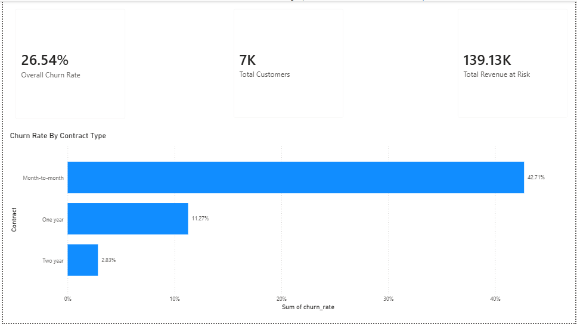
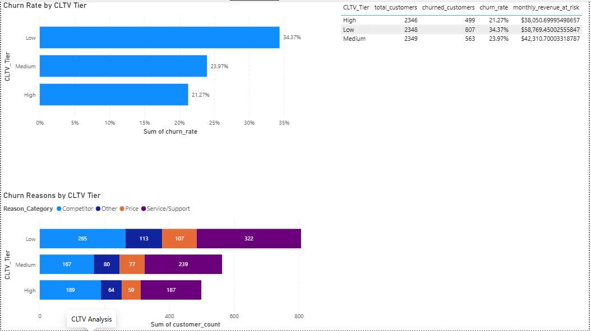

# Telecom Churn & Retention Analysis

## Business Question
What drives customer churn in this telecom dataset, and how should retention 
strategy be prioritized based on contract structure, customer tenure, and 
service quality — regardless of customer value tier?

## Methodology Note
The initial hypothesis tested whether churn reasons differ significantly 
across CLTV (Customer Lifetime Value) segments. A chi-square test found no 
significant relationship (p = 0.22), so the analysis was refined toward 
contract type and tenure, which proved to be strong, statistically validated 
drivers instead.

## Key Findings
1. **Contract type is the dominant churn driver** — month-to-month customers 
   churn at 42.7%, versus 11.3% for one-year and 2.8% for two-year contracts 
   (a 15x gap between extremes).
2. **Churned customers leave early and pay more** — average tenure of 18 
   months vs. 37.6 months for retained customers, while paying $74.44/month 
   on average vs. $61.27 for retained customers.
3. **CLTV is significantly lower among churned customers** (t-test, p < 0.0001), 
   consistent with a tenure-weighted lifetime value index — customers churn 
   before lifetime value has a chance to accumulate.
4. **Churn rate itself scales inversely with CLTV tier** — Low-CLTV customers 
   churn at 34.4%, nearly 1.6x the rate of High-CLTV customers at 21.3%.
5. **Service/Support issues are the single largest cited churn reason (~40%)**, 
   and this holds consistently across all customer value tiers rather than 
   concentrating in one segment (chi-square, p = 0.22).
6. **Competitor-driven churn is the second-largest category (~33%) overall**, 
   and in the High-CLTV tier specifically, it runs nearly even with 
   Service/Support (37.9% vs. 37.5%) — the only tier where competitive 
   poaching rivals service complaints as a leading cause.

## Recommendation
Retention efforts should prioritize (1) contract incentive programs targeting 
new, high-spend, month-to-month customers — the highest-risk segment — and 
(2) company-wide service-quality investment, since support-related complaints 
drive churn consistently across value tiers. For the High-CLTV segment 
specifically, competitive retention offers are worth testing alongside 
service fixes, given the near-even split with competitor-driven churn there.

## Dashboard

### Executive Summary

### CLTV Segment Analysis

## Data Source
Telco Customer Churn: IBM Dataset (Kaggle, uploader: yeanzc) — 7,043 
customers, 33 variables, including Churn Reason and CLTV (a Customer Lifetime 
Value index, not a dollar figure). This version was chosen over the more 
commonly used 21-column variant specifically for its Churn Reason and CLTV 
fields, which most public analyses of this dataset don't use.

## Tools
Python (pandas, scipy) for cleaning and statistical testing, SQL Server for 
aggregation and cross-validation, Power BI for dashboarding. Key findings 
(overall churn rate, churn rate by contract type) were independently verified 
across all three tools, with matching results to two decimal places.

## Status
Complete — Python cleaning/EDA, SQL aggregation views, and Power BI dashboard 
all finished and cross-validated.